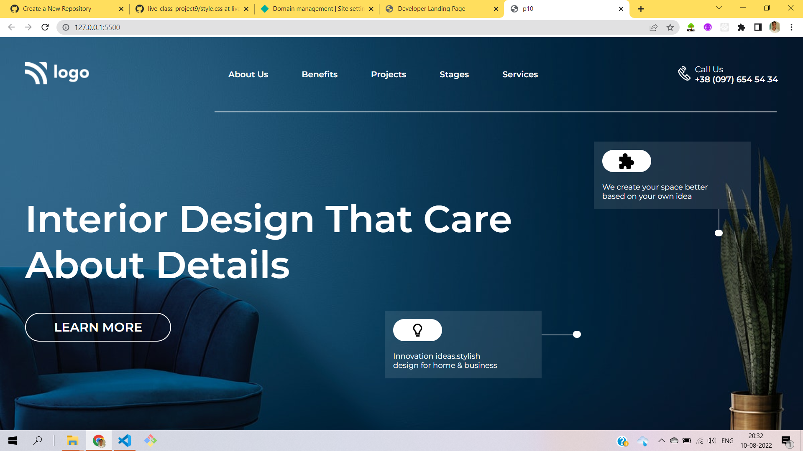

# Hi I'm Aravind

In this project i built interior design company landing page using the below `tech stack` concepts

- HTML5
- CSS3
  - I learned to use grid to align div containers in columns and rows
  - I learned to use flexbox a css module
  - I learned to ::before and ::after pseudo elements

> Here's the glimpse pic of the project

live-link [interior-design](https://interior-design-page-project-10.netlify.app/)
